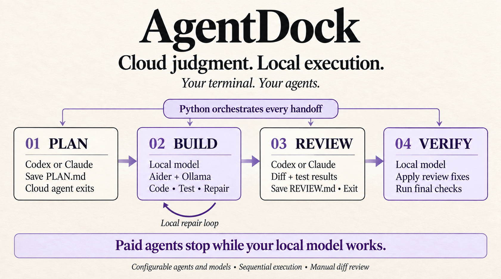

# Afterhours

**Apps, tools, and experiments built after hours.**

A personal collection of projects developed at home, from AI agents to everyday
tools. Each project has its own setup guide, dependencies, tests, and release notes.
Start with one tool; install only what it needs.

## Explore the tools

| Tool | What it does | Category | Status |
| --- | --- | --- | --- |
| [AgentDock](tools/agentdock/README.md) | Plan with Codex or Claude, implement with a local model, then return for review. | Coding workflow | Experimental |

### AgentDock

<p align="center">
  <a href="tools/agentdock/README.md">
    
  </a>
</p>

A terminal workspace with named agents, configurable models, local repair loops,
and clear handoffs between planning, coding, and review. Paid agents exit while
the local model works.

From your local checkout:

```bash
cd tools/agentdock
python3 scripts/install.py
agentdock
```

The installer requires `uv`. See the [complete setup guide](tools/agentdock/README.md#quick-start)
for provider CLIs, authentication and local models, and read AgentDock's
[current security limitations](tools/agentdock/SECURITY.md) before use.

## Repository layout

```text
Afterhours/
├── README.md
├── CONTRIBUTING.md
├── LICENSE
├── .github/workflows/
└── tools/
    └── agentdock/
        ├── README.md
        ├── pyproject.toml
        ├── src/agentdock/
        ├── tests/
        ├── scripts/
        └── docs/
```

New tools go under `tools/<tool-name>/` and get an entry in the catalog above.
There is no shared runtime to install at the collection root.

## Contributing

See [CONTRIBUTING.md](CONTRIBUTING.md) for the project structure and testing
expectations. Keep local configuration, model files, credentials and session logs
out of published changes.

## License

[MIT](LICENSE), unless a project explicitly specifies otherwise. Third-party
models, providers and dependencies retain their own licenses and terms.
