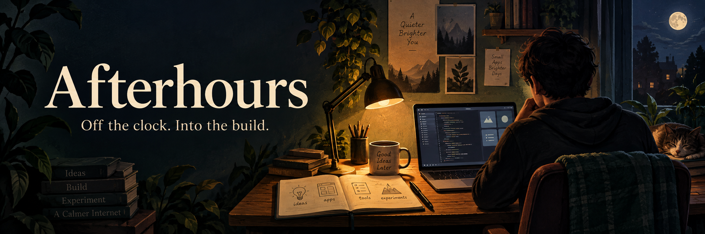

# Afterhours

A growing collection of apps, tools, and late-night experiments.
Pick a project. Take a look around.

| Preview | Project | Type | What it does |
| :---: | --- | --- | --- |
|  | [Gp Notes](apps/Gp%20Notes/README.md) | App | **From conversation to a considered draft.** Turn synthetic consultations into editable SOAP notes, then review and export. |
|  | [AgentDock](tools/agentdock/README.md) | Tool | **Your coding agents, one workspace.** Plan with cloud models, build with local models, and keep the handoffs in view. |

---

[Contributing](CONTRIBUTING.md) · [MIT License](LICENSE)
