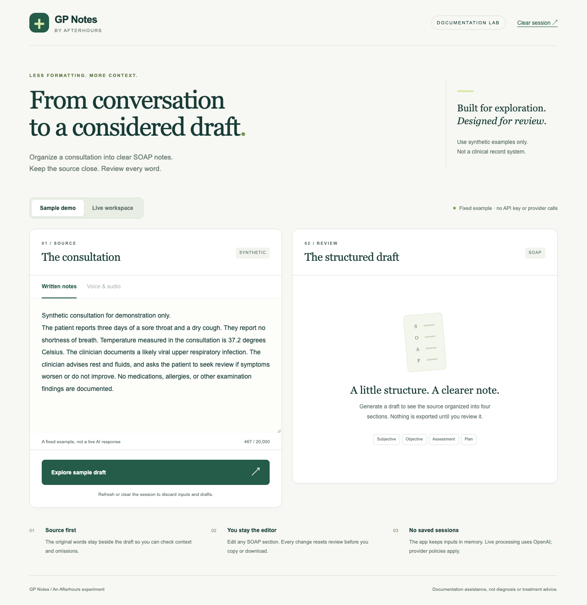

# Gp Notes

**From conversation to a considered draft.**

A small documentation lab for turning synthetic consultation notes into editable
SOAP drafts. Keep the original source alongside the draft, correct the wording,
and explicitly review before copying or downloading.

Part of [Afterhours](../../README.md). **Open-source demo / experimental live mode.**
This is not a clinical record system, diagnostic tool, or validated medical product.



## Try it in two minutes

Requires **Node.js 22.18+** and npm. From the Afterhours checkout:

```bash
cd "apps/Gp Notes/Frontend/gp-notes"
npm ci
npm run dev
```

Open **http://localhost:3000** and select **Explore sample draft**. No account,
provider key, environment file, or paid request is needed. The sample is a fixed,
clearly labeled synthetic example; it does not pretend to run AI on arbitrary text.

1. Compare the source with the Subjective, Objective, Assessment and Plan sections.
2. Edit a section. Missing details remain explicit rather than being filled in.
3. Check the review box, then copy or download the note as text.
4. Clear the session to discard its inputs, draft and workspace token.

## What it does

- **Sample demo:** a reproducible walkthrough with no provider calls.
- **Live written notes:** organize up to 20,000 characters into a structured draft.
- **Live audio:** record up to three minutes or upload up to 10 MB of WebM,
  MP4/M4A, MP3 or WAV audio. The microphone stops on completion, cancellation,
  navigation or an error.
- **Review workspace:** source and editable draft in one responsive page; changes
  reset review. Downloaded text includes source and sample/live provenance.
- **Session-only app state:** no database, analytics, browser-storage persistence,
  or application logging of tokens, audio, transcripts or drafts.

## Enable live mode

Live mode is opt-in. The old project's local credentials alone do not enable it.
From the application directory:

```bash
cp .env.example .env.local
openssl rand -hex 32
```

Set the following in `.env.local`, using the generated value as the workspace token:

```dotenv
GP_NOTES_LIVE_ENABLED=true
OPENAI_API_KEY=your-provider-key
GP_NOTES_ACCESS_TOKEN=your-own-random-token-at-least-32-characters
OPENAI_NOTE_MODEL=gpt-4o-mini
OPENAI_TRANSCRIPTION_MODEL=whisper-1
```

Restart the app. Select **Live workspace**, enter the **workspace access token**
(not the OpenAI API key), and acknowledge the synthetic-data/provider-processing
notice. Paste notes or choose **Voice & audio**. Provider processing may incur
charges. Never prefix either credential with `NEXT_PUBLIC_`.

Recording requires localhost or HTTPS and microphone permission. Use
`npm run dev:https` for a local HTTPS development server. File upload also works
when microphone recording is unavailable.

The note model must support strict JSON Schema output through Chat Completions.
The transcription model must support file transcription returning `text`. Both
models are configurable; account access and service availability may differ.
See the official [structured outputs](https://developers.openai.com/api/docs/guides/structured-outputs)
and [speech-to-text](https://developers.openai.com/api/docs/guides/speech-to-text)
documentation for the provider interfaces used here.

## How it works

```text
Browser: sample fixture request ───────────────► fixed synthetic draft
Browser: text/audio + workspace token ─────────► Next.js API
                                                 ├─ opt-in/config/auth checks
                                                 ├─ request size + rate limits
                                                 ├─ audio transcription (if needed)
                                                 ├─ structured note generation
                                                 └─ runtime output validation
Browser memory ◄──────────────────────────────── transcript + editable draft
       └─ source comparison → explicit review → copy / .txt download
```

The server asks the model to preserve stated facts, negations, uncertainty and
attribution, and to mark missing sections as “Not documented.” Review notes flag
documentation gaps; the prompt does not request treatment suggestions. Schema
validation ensures a usable shape, **not factual or clinical correctness**.

## Verify

From `Frontend/gp-notes/`:

```bash
npm run check                 # lint, types, unit/API tests, production build
npx playwright install chromium
npm run test:e2e              # desktop + mobile Chromium workflows
npm audit
```

Tests use synthetic fixtures and mocked provider responses, never real patient
information or paid API calls. Browser tests launch the production build on port
3107 with a deliberately fake provider key. Run `npm run build` first if you did
not run `check`. Physical microphone behavior and real provider output still need
manual verification; see [testing notes](docs/TESTING.md).

## Hosting

For a **public showcase**, leave live mode disabled. Use a Node-capable Next.js
host with the project root set to `apps/Gp Notes/Frontend/gp-notes`,
install with `npm ci`, build with `npm run build`, and start with `npm start`.
There is no static-export configuration and no separate backend service.

Live mode is intended for controlled, synthetic-data experimentation. It uses one
shared workspace token and a per-process budget (10 requests/minute and two active
requests). These are not user accounts or distributed abuse controls. Put a live
instance behind HTTPS and access restrictions; configure ingress body limits and
timeouts, a shared rate limiter for multiple workers, and provider spend limits.
Requests from browsers must have an Origin matching the public Host and protocol.
Behind a reverse proxy, set `GP_NOTES_ORIGIN=https://your-host.example` to the exact
browser origin (no trailing slash). Serverless hosts may impose lower upload
limits or shorter request lifetimes than this app.

Read [SECURITY.md](SECURITY.md) before enabling live mode or changing data handling.

## Project layout

```text
Gp Notes/
├── README.md, SECURITY.md, CHANGELOG.md
├── docs/TESTING.md
└── Frontend/gp-notes/
    ├── app/                  # responsive workspace + API route adapters
    ├── lib/notes.ts          # shared types, fixture and export format
    ├── lib/service.ts        # request validation, auth and limits
    ├── lib/provider.ts       # isolated OpenAI adapter
    ├── tests/                # service and provider regression tests
    └── e2e/                  # desktop/mobile browser tests
```

The original Express spike is superseded by the Next.js routes. Its files remain
only in the maintainer's ignored `.legacy-prototype/` backup; they are not part of
the published application. Old `/login` and `/results` links redirect to the workspace.

## License

[MIT](../../LICENSE). Dependencies retain their own licenses and provider services
their own terms. Contributions should include relevant regression tests and keep
all credentials and consultation content out of commits and issue reports.
