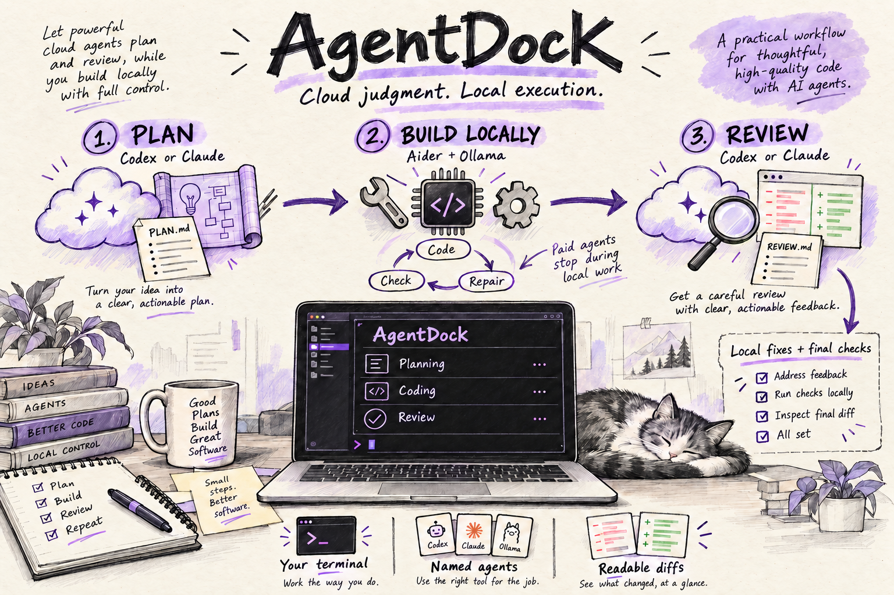
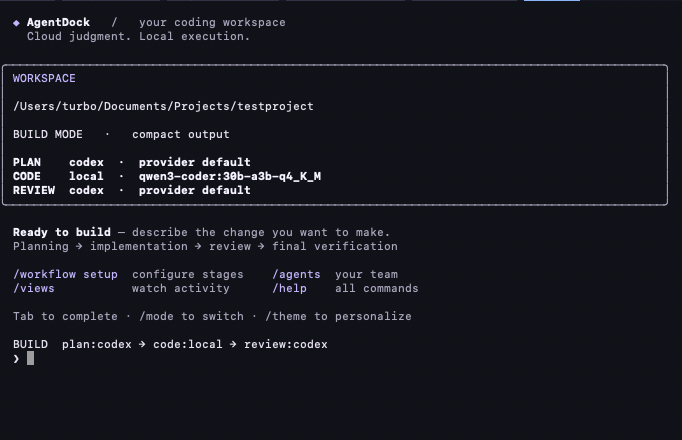
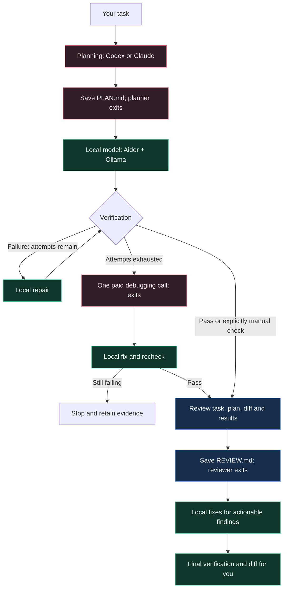

<p align="center">
  
</p>

# AgentDock · Your terminal, your agents

Part of the [Afterhours collection](../../README.md).

> **Experimental / alpha.** Review the known limitations in
> [SECURITY.md](SECURITY.md) before using this on important or sensitive projects.

**Plan with Codex or Claude. Build with a local model. Return for review.**

**AgentDock** is a Python terminal workspace for named coding agents. Its staged workflow
hands implementation and repeated debugging to a local model through **Aider + Ollama**,
while using Codex or Claude for planning and review. Run `agentdock` to open the interactive workspace.

The paid agent exits before local coding begins. Local repair attempts do not call
the paid agent on every failure. This is designed to reduce paid-model usage;
planning, review and optional escalation still consume your provider's allowance.

<p align="center">
  <a href="#quick-start">Quick start</a> ·
  <a href="#how-the-workflow-runs">Workflow</a> ·
  <a href="#agents-and-models">Agents &amp; models</a> ·
  <a href="#step-by-step-set-up-planning-coding-and-review">Stage setup</a> ·
  <a href="#terminal-experience">Terminal UI</a> ·
  <a href="#command-reference">Commands</a> ·
  <a href="#troubleshooting">Troubleshooting</a>
</p>

> The command, Python package and distribution are all named `agentdock`.
> Project state lives in `.agentdock/`.

### Working view

<p align="center">
  
</p>

## What you get

| Capability | What it does |
| --- | --- |
| Three configurable stages | Choose agents and model overrides independently for planning, coding and review. |
| Local implementation loop | Inspect files, edit code, add tests and repair failures using Aider and Ollama. |
| Named agents | Create project-specific agents and switch between them in chat. |
| Live terminal output | Compact progress and elapsed-time indicators; full provider output available with `/output raw`. |
| Readable code changes | Per-step diff previews with red removals, green additions and line-change counts. |
| Read-only panes | Monitor active agents in a second terminal with no extra model calls. |
| Automatic local setup | Start Ollama on demand; install missing Aider in an isolated environment. |
| Model cleanup | Unload local models first loaded by this session when the session exits. |
| Optional Git | Work in an existing repository or a new directory without creating a commit. |
| Project-specific checks | Java and Gradle are not prerequisites. |

## Terminal experience

AgentDock keeps the terminal familiar while making long coding sessions easier to
follow:

- **Workspace at a glance:** a framed project header with the current mode,
  output setting, and agent/model assignments for each build stage.
- **Clear progress:** distinct stage headings and animated elapsed-time indicators
  while agents run, even when they are not emitting text.
- **Readable responses:** headings, inline emphasis, highlighted code references
  and framed code blocks in interactive chat.
- **Reviewable edits:** filenames, surrounding context, and addition/removal counts
  for actual saved text changes after each local coding step.
- **Useful shortcuts:** command hints at startup and Tab completion while typing.

A single accent runs throughout the interface—there are no red/green/blue stage
colors. Red and green are reserved for diffs. Change the saved project theme inside chat:

```text
/theme violet
/theme amber
/theme mono
```

Violet is the default: soft lavender accents, muted
gray-lavender details and pale headings. True-color terminals use the exact
palette; 256-color and basic terminals use compatible approximations. Existing
amber or mono preferences are preserved; use `/theme violet` to switch back.
Framed AgentDock panels use a dark `#101219` background with readable
light text (approximated on terminals without true color). Only the printed panel
cells are painted; your terminal background and settings remain unchanged.

Mono removes foreground and panel-background styling; `NO_COLOR` and non-interactive
output also suppress ANSI colors. Your terminal still controls its background and
font. See the [terminal workspace illustration](docs/assets/agentdock-overview.svg)
for the dark UI style; exact output depends on your configuration.

Use `/clear` to redraw a fresh workspace header without losing your chat context.
Use `/new` only when you want to clear the selected agent's conversation.
These presentation features do not change agent permissions or make extra model calls.

### Full-screen workspace

Interactive chat uses the dark workspace by default:

```bash
agentdock
```

This mode paints terminal output with a dark background,
light text and the selected accent theme. It does not modify your Terminal profile
or use terminal-default color changes. Normal exit and handled errors restore the
terminal text attributes and retain the chat in normal scrollback. Apple Terminal uses compatible ANSI colors; exact shades
depend on terminal support. Resize-aware panels keep the layout within the terminal.

Native `/code` sessions and `/views` temporarily take over with their own UI;
returning resumes the painted workspace without clearing earlier output.
Use normal terminal scrolling to read earlier responses. `NO_COLOR`, mono theme,
redirected input/output and dumb terminals skip full-screen mode. Force-killing
the process cannot guarantee restoration; use your terminal's Reset command if needed.
Run `agentdock --no-fullscreen` for the panel-only appearance.
`--fullscreen` remains available to explicitly enable the default painted workspace.
One-shot messages and non-chat commands do not enter full-screen mode.

New interactive sessions start in **chat mode**, using the local model by default.
Use `/build` to switch modes; ordinary messages then start the staged build workflow.
Use `/chat` to return to conversation. `/mode chat` and `/mode build` are aliases.
`/build TASK` runs one build without changing the current mode. Explicit `--agent`
and saved `/default` agent choices still apply.

## Quick start

### 1. Install the terminal tool

Install once as a user-level terminal app. **No virtual-environment activation is
needed afterward.** On macOS, from your checkout:

```bash
cd /path/to/Afterhours/tools/agentdock
brew install uv  # only if uv is not already installed
python3 scripts/install.py
```

Then, from any project directory:

```bash
agentdock
```

The installer uses [uv tool installation](https://docs.astral.sh/uv/guides/tools/)
to create an isolated Python 3.12 environment and expose `agentdock`
on your PATH (normally through `~/.local/bin`). It downloads Python if needed.
If PATH changes are needed, it updates your shell setup and asks you to open a new
terminal. No sudo is needed. Existing project settings remain in `.agentdock/`.

This installs a **terminal application**, not a graphical `.app`, signed `.pkg`,
or published App Store app. It does not bundle provider CLIs or local models.
The standard install copies the package; it does not depend on the checkout or
the project's `.venv` afterward.

To update after changing or pulling the source, rerun `python3 scripts/install.py`.
For development with immediate source updates, use `python3 scripts/install.py --editable`
and keep the checkout in place. To uninstall only the tool:

```bash
uv tool uninstall agentdock
```

Project files, models and `.agentdock/` data are not removed by tool uninstallation.

### Install a distributable package

Build a wheel to share or install without the source checkout:

```bash
uv build --wheel
uv tool install --python 3.12 /path/to/agentdock-0.1.0-py3-none-any.whl
```

If uv reports that its executable directory is not on PATH, run
`uv tool update-shell` and open a new terminal. The wheel is not a standalone
Python interpreter; uv supplies the isolated runtime. This package is not yet
published on a package index.

### 2. Prepare your providers

| Component | Setup |
| --- | --- |
| Codex **or** Claude CLI | Install your chosen CLI and complete its own login. Check that it works directly in your terminal. |
| Ollama | Install Ollama and download your chosen local model once. agentdock can start its local server on demand. |
| Aider | No manual installation required: first local coding use installs it if missing. |
| Project tools | Install what the project's check command needs, such as Node.js or Python test dependencies. |

The default local model is `qwen3-coder:30b-a3b-q4_K_M`.
If you do not already have it, start Ollama and explicitly download it:

```bash
ollama pull qwen3-coder:30b-a3b-q4_K_M
```

The wrappers use your installed providers' existing authentication. No API key is
required by agentdock's subscription workflow; access still depends on your account,
organization and CLI configuration. agentdock does not bypass provider restrictions
or convert subscription access into a general API.

### 3. Open the project you want to build

```bash
cd /path/to/your-project
agentdock
```

For a new project, create a directory first. Git initialization is your choice.
Settings belong to the detected Git root, or the current directory without Git.

### 4. Assign the stages

Inside chat:

```text
/workflow setup
```

The wizard asks for an existing agent and an optional model override per stage:

| Stage | Example agent | Model selection |
| --- | --- | --- |
| Planning | `codex` or `claude` | Enter a supported model ID, or press Enter to inherit. |
| Coding | `local` | Defaults to the configured local Qwen model. |
| Review | `codex` or `claude` | Can use a different model from planning. |

Answer **`y`** to “Treat ordinary messages as build tasks?” to enter build mode.
Setup enables review and assigns debugging escalation to the chosen planner.
Use `/create` first if you want custom named agents.

### 5. Give it a task

```text
build [plan:codex → code:local → review:codex] › Build a coming-soon page in HTML
```

Type only your request—the `build […] ›` text is the prompt, not your command.

For a one-off workflow from normal chat:

```text
/build Add exponential retry handling for HTTP 429 and 503
```

Or use your shell:

```bash
agentdock run "Build a coming-soon page in HTML"
```

> In **build mode, every ordinary message is a task**, including `hi`.
> Use `/mode chat` for conversation and `/mode build` to return to building.

## How the workflow runs



1. **Plan.** Inspect the project and produce likely files, implementation steps,
   architecture considerations, edge cases, tests and acceptance criteria.
2. **Implement locally.** Aider receives `TASK.md`, `PLAN.md` and relevant project
   files. The local model edits code and adds or updates tests.
3. **Verify and repair.** Run the verification command. Failures return to the local
   worker for up to `max_repair_attempts` repairs—four by default.
4. **Escalate only if needed.** After local attempts are exhausted, make one paid
   debugging call, apply its advice locally and recheck. Stop if verification still fails.
5. **Review.** Send the task, plan, diff and relevant verification output to the
   reviewer. The worker conversation is not included. Review can be disabled.
6. **Finish locally.** Apply actionable findings, run final verification and print
   the diff. A failed final check stops the run; it does not silently pass.

These are **sequential handoffs**, not autonomous agents messaging each other in
a background loop. A normal run uses planning and review calls; escalation adds
one more paid call when needed. No paid agent stays running through local repairs.

### Verification without assuming a framework

The planner must provide a line such as:

```text
VERIFY_COMMAND: npm test
```

Other projects might use `python -m pytest` or `./gradlew test`. Commands run
directly as argument lists, without a shell. Install their required dependencies;
use a project script for multi-step checks.

For a static page with no meaningful automated check:

```text
VERIFY_COMMAND: NONE
```

The plan must include manual verification steps. The workflow continues but records
**NOT RUN / manual verification required**, never “tests passed.” A missing field
is an error; there is no automatic Gradle fallback.

## Agents and models

### Step by step: set up planning, coding and review

An **agent** is a named provider configuration. A **model** is the model that agent
uses. A **stage** assigns an agent to planning, coding or review. Changing your
selected chat agent does not change these workflow assignments.

#### 1. Open AgentDock in your project

Run these in your normal terminal:

```bash
cd /path/to/your/project
agentdock
```

The remaining slash commands run **inside AgentDock**. Settings are saved for
this project in `.agentdock/config.json`.

#### 2. Choose existing agents or create your own

```text
/agents
```

You can use the built-in `codex`, `claude` and `local` agents immediately after
their provider tools are set up. For custom names, run `/create` three times and
answer the prompts using this example:

| Prompt | Planning agent | Coding agent | Review agent |
| --- | --- | --- | --- |
| Agent name | `planner` | `coder` | `reviewer` |
| Backend | `codex` | `local` | `claude` |
| Model ID | Enter for provider default | `qwen3-coder:30b-a3b-q4_K_M` | Enter for provider default |
| Use as startup agent? | `n` | `n` | `n` |

You may use `codex` for both cloud agents, or `claude` for both. Enter an actual
provider-supported model ID instead of accepting the default if you want a
specific cloud model. The local model must already be installed in Ollama.
Creating an agent does not sign in to a provider or download its model.

#### 3. Assign each stage and its model

```text
/workflow setup
```

For the custom agents above, answer the wizard as follows:

| Wizard prompt | Enter | Result |
| --- | --- | --- |
| planning agent | `planner` | Codex creates the plan. |
| planning model | `inherit` | Use the model saved on `planner`. |
| coding agent | `coder` | Aider + Ollama implement and repair locally. |
| coding model | `qwen3-coder:30b-a3b-q4_K_M` | Use this installed local model for coding. |
| review agent | `reviewer` | Claude reviews the resulting changes. |
| review model | `inherit` | Use the model saved on `reviewer`. |
| Treat ordinary messages as build tasks? | `y` | Ordinary messages now start the full workflow. |

If you skipped custom-agent creation, enter `codex`, `local` and `claude` as the
three agent names instead. You can also enter `codex` for the review agent.

At any stage's model prompt, enter a model ID to override that agent's model
**only for that stage**. Enter `inherit` to remove an existing stage override.
Pressing Enter preserves the current override, if one exists. The wizard enables
review and uses the planning agent for escalation after local repairs are exhausted.
Currently planning/review require Codex or Claude; coding requires Aider + Ollama.

#### 4. Check the assignments

```text
/workflow
/status
```

Confirm the planning, coding and review agents and models, and that review is
enabled. `provider default` or `(default)` means no explicit model was selected;
it is not a verified model identity. Stage-specific overrides may appear with
names such as `planning:planner` in the displayed configuration.

#### 5. Start a build

```text
/build Create a responsive coming soon page in index.html
```

This explicit command works in either input mode. If you chose build mode in the
wizard, you can also type the task without `/build`.

AgentDock runs **plan → local coding/tests/repairs → review → local fixes/final
verification**. The paid agent exits before local work begins. Review findings
are saved to `.agentdock/REVIEW.md`; use `/diff` to inspect the resulting changes.

#### 6. Change a model later

Run `/workflow setup` again to change stage assignments or stage-specific models.
To change an agent's own model instead:

```text
/agent coder
/model ollama_chat/YOUR_INSTALLED_MODEL
```

Replace `YOUR_INSTALLED_MODEL` with a model installed in Ollama. An existing coding
stage override still takes precedence: enter `inherit` at that stage's model
prompt if you want it to follow the agent's new model. Use `/mode chat` to stop
treating ordinary messages as build tasks; `/build TASK` remains available.

### Agent and model controls

Three agents are provided initially: `codex`, `claude` and `local`.
Create your own with `/create`: choose a name, backend (`codex`, `claude`, or
`local`), model ID and whether it should be your startup chat agent.
The local backend is stored as `aider_ollama`.

```text
/agents
/agent my-local-agent
/model ollama_chat/qwen3-coder:30b-a3b-q4_K_M
/default
```

| Choice | What changes |
| --- | --- |
| `/agent NAME` | Selected chat/native agent. Workflow assignments are unchanged. |
| `/model MODEL_ID` | That agent's saved model, used on its next invocation. |
| `/model reset` | Clear the agent override; cloud uses provider default, local uses `qwen_model`. |
| `/default` | Agent selected when chat next starts. |
| `/workflow setup` | Agents and optional model overrides for each build stage. |

Stage model overrides take precedence over an agent's model and do not modify
its chat settings. Enter `inherit` in a wizard model field to clear the stage
override. The same cloud agent can use different planning and review models.
Model IDs must be supported by the provider and your account.

### Choose the Codex model in agentdock

There are two places to choose a model: the **chat agent** and the **build stages**.
The commands below run inside `agentdock`, not in your shell. Replace `YOUR_MODEL_ID`
with an actual model ID accepted by your installed Codex CLI and account; it is a
placeholder, not a model name. agentdock does not provide a live catalog of available models.

#### Planning and review models

Run:

```text
/workflow setup
```

Choose `codex` at the planning-agent prompt, then enter your model ID:

```text
planning agent [codex]: codex
planning model [inherit agent model]; 'inherit' clears override: YOUR_MODEL_ID
```

Continue through the coding prompts to keep or change the local agent/model.
At the review prompts, choose `codex` and enter the same model ID or a different one.
Finish the wizard to save the settings, then inspect the complete assignments:

```text
/workflow
```

These overrides apply to the next build. They do not change the agent's chat model.
Debugging escalation also uses the planning model when it is assigned to that same planner.

#### Chat model

To select the Codex agent and set its model:

```text
/mode chat
/agent codex
/model YOUR_MODEL_ID
/model
```

The final `/model` displays the saved selection. `/model set YOUR_MODEL_ID` is an
equivalent spelling. Use the name you created instead of `codex` if you have a custom
Codex-backed agent. The change takes effect on its next invocation, including the
next native launch; it does not alter an already-running native session.

#### Reset or inherit a model

| Intended result | Action |
| --- | --- |
| Clear the chat agent's explicit model | Select the agent, then run `/model reset`. |
| Make planning or review follow that agent's model | Run `/workflow setup` and enter `inherit` at that stage's model prompt. |
| Keep an existing stage override | Press Enter at its model prompt. Enter does **not** clear an existing override. |
| Check build assignments and effective stage models | Run `/workflow`. |
| Check the selected chat agent's configured model | Run `/model`. |

For builds, selection follows **stage override -> agent model -> provider default**. Consequently, changing `/model` alone will not change a stage that has its own override. To return fully to the provider default, clear the stage override and agent model.

Selections are saved per project in `.agentdock/config.json`. Saying “switch models”
in an ordinary message does not change these settings—use the slash commands.
`(default)` means no explicit model ID is set; it is not a verified identity of
the model serving your request.

### Chat, build and native coding

| Mode | What ordinary input does | File editing |
| --- | --- | --- |
| `/mode chat` | Ask the selected agent a question. | Instructed not to edit; local chat has no repository tools. |
| `/mode build` | Start the configured staged workflow. | The local worker edits the project. |
| `/code` or `/native` | Open the selected tool's interactive interface. | Governed by native permissions and commands. |

Native coding opens Codex, Claude or Aider using the selected model. Exit it to
return to agentdock. Native slash commands live in the native tool; agentdock does
not emulate their full command sets. Launcher history is not copied into native sessions.

Launcher chat keeps separate in-memory conversations per agent: up to six recent
exchanges and approximately 24,000 characters. `/new` clears the selected agent's
context. Agent-to-agent `/send` and `/handoff` commands are not implemented.

## Live output and read-only panes

After each local implementation, repair or review-fix step, AgentDock displays
the text changes actually saved to disk: **red removals** and **green additions**,
with filenames and surrounding context. These are per-step diffs, so unchanged
pre-existing edits are not repeated. Previews are capped at 120 lines; `/diff`
shows the full current diff, and `.agentdock/diff.patch` stores the workflow result.
The preview uses the same text-file snapshot exclusions described below; binary,
large and excluded files are not shown. This display occurs when the local step
finishes, not token-by-token as the model generates code. Native `/code` sessions
keep their own diff display. `NO_COLOR`, mono theme and redirected output stay plain.

The interactive workspace header groups your project, input mode, and selected
agents in one panel. Stage dividers, formatted responses, and addition/removal
counts make longer sessions easier to scan. The design uses one restrained accent;
red and green are reserved for code changes. `/theme violet`, `/theme amber`, or
`/theme mono` changes the appearance. `/clear` clears the screen and redraws the
workspace header without resetting your conversation.

During local coding, compact output shows brief Aider narration and applied-file
messages, while keeping code blocks and tool banners out of the terminal. Long
invocations display a live spinner and elapsed-time timer in interactive terminals.
This is observable tool activity, not access to hidden model reasoning. If the
model emits no progress text, the timer continues while token usage is pending.

Codex, Claude, local chat, Aider coding and Ollama model loading all display the
timer. It updates in place, clears when progress text arrives, and shows total
elapsed time at completion. Mode, model and reported token usage appear in a
footer below the input field, cleared on submission so they do not repeat in
conversation history. Chat shows the last
response's usage; build shows the total reported across its agent invocations.
Missing counts are omitted, and rounded counts use `≈`. Detailed usage remains
available in `/views` and `watch --once`. Native sessions retain their own UI.
Redirected output uses plain updates every 15 seconds
instead of terminal controls. Native `/code` sessions keep their provider's own UI.
Cloud prompts and tool output stay hidden in compact mode; completed plans and
reviews are printed once.

Builds use compact output by default: stage progress, the completed plan once,
the review once, and a link to the saved diff. Provider banners, echoed prompts,
command dumps and generated source blocks remain in logs rather than flooding
the terminal. Use `/diff` to inspect the patch. `/output raw` restores full live
provider output; `/output compact` switches back. This setting is saved per project.
Providers may buffer output; only what their CLIs expose can be displayed.
Normal chat retains its single-response presentation.

In a second terminal, enter the **same project** and run:

```bash
agentdock watch
```

| Key or command | Action |
| --- | --- |
| `←` / `→`, or `p` / `n` | Move between pages of agent panes. |
| `q` | Close the dashboard without stopping agents. |
| `/views` | Open the dashboard in chat; chat input pauses until you close it. |
| `agentdock watch --once` | Print a non-interactive activity snapshot. |

Wide terminals use two columns; narrow terminals use one. Running invocations
appear first, followed by the latest results or idle agents. Monitoring makes no
model calls and sends no keystrokes to agents.

Panes are output views, not exact copies of provider screens. Native interfaces
can produce repeated redraw text. Native capture requires an interactive terminal.
The dashboard does not create parallel agent execution.

## Automatic local setup and cleanup

### Aider

An existing `aider` on PATH is reused. Otherwise first local coding use installs
Python 3.12 and Aider with uv under `.agentdock/tools/`. If uv is missing, an isolated
bootstrap environment installs it. This needs internet access and can take several
minutes; later runs reuse the installation. System Python packages are not modified.
Installation output is in `aider-install.log` and the dashboard.

### Ollama

Ollama itself and the chosen model must already be installed. When a configured
local HTTP endpoint refuses the connection, agentdock starts `ollama serve` and
waits for readiness. Existing servers are reused; remote servers are not started
locally. Missing models produce a download instruction, not an automatic large download.

The model loads before local work. Workflow preflight checks installation;
loading waits until local implementation starts. Warm-up requests use a five-minute
keep-alive; later provider requests may change that duration.

### On exit

The session attempts to unload local models that were not running when it first
used them. Pre-existing models are left alone. Cleanup runs on normal chat exits,
one-shot completion and handled error exits. The shared Ollama server remains
running, and model files remain installed.

If ownership cannot be checked, the model is left alone. Force-killing agentdock
cannot run cleanup. Another application sharing a model loaded by this session
may need to reload it afterward. Models selected only inside a native UI are not
tracked by the launcher's cleanup.

## Command reference

### Inside agentdock

| Command | Purpose |
| --- | --- |
| `/help` | Show commands. |
| `/theme`, `/theme violet`, `/theme amber`, `/theme mono` | Show or change the terminal theme. |
| `/create`, `/agents` | Create an agent or list configured agents. |
| `/agent NAME`, `/default` | Select a chat/native agent or save it as startup default. |
| `/model`, `/models` | Show the current model or models configured across agents. |
| `/model MODEL_ID`, `/model set MODEL_ID` | Set the selected agent's model. |
| `/model reset` | Clear its model override. |
| `/workflow`, `/workflow setup` | Inspect or configure build stages. |
| `/chat`, `/build` | Switch between conversation and the build workflow for this session. |
| `/mode`, `/mode chat`, `/mode build` | Inspect or change how ordinary messages are handled. |
| `/build TASK`, `/run TASK` | Run the staged workflow for one task. |
| `/code`, `/native` | Open the selected agent's native coding interface. |
| `/codex`, `/claude` | Open the corresponding default native agent. |
| `/views` | Read-only agent dashboard. |
| `/output compact`, `/output raw` | Choose concise results or full provider logs. |
| `/status` | Project, agent/workflow and state location. |
| `/diff` | Show the current diff; see Git limitations below. |
| `/clear` | Clear the screen and redraw the workspace header; retain chat context. |
| `/new` | Clear the selected chat agent's in-memory context. |
| `/exit`, `/quit` | Exit and attempt session-model cleanup. |

Tab completion is available for launcher commands, agent names and configured
models. Ctrl-C cancels the current operation and returns to chat where possible;
it does not exit chat. Use `/exit` or EOF to leave.

### From your shell

```bash
agentdock
agentdock chat --agent codex
agentdock run "Build a coming-soon page in HTML"
agentdock workflow show
agentdock workflow setup
agentdock agents list
agentdock agents show local
agentdock agents add my-local --backend aider_ollama --auth local \
  --model ollama_chat/qwen3-coder:30b-a3b-q4_K_M
agentdock agents remove my-local
agentdock doctor
agentdock watch
agentdock watch --once
```

`agentdock --agent local "QUESTION"` runs one message; it still respects the saved
mode, so select chat mode first for questions. Agents referenced by the workflow
or selected as default cannot be removed until those references change.
Agent creation also supports `--role`, `--timeout-seconds`, `--default` and
explicit `--replace`.

`agentdock "TASK"` remains a shortcut for `agentdock run "TASK"`.
`run --skip-doctor` skips preflight, not execution dependencies.
Doctor reports missing tools without installing them or starting services.

## Configuration

First use creates `.agentdock/config.json`. Prefer the wizard; this partial example
shows stage settings you can merge into the generated file:

```json
{
  "chat_mode": "build",
  "workflow": {
    "planner_agent": "codex",
    "worker_agent": "local",
    "reviewer_agent": "claude",
    "debugger_agent": "codex"
  },
  "stage_models": {
    "planning": null,
    "coding": "ollama_chat/qwen3-coder:30b-a3b-q4_K_M",
    "review": null
  },
  "max_repair_attempts": 4,
  "verification_command": null,
  "final_codex_review": true
}
```

| Setting | Meaning |
| --- | --- |
| `version` | Schema version; currently `2`. |
| `agents` | Named agents: `backend`, `auth`, `model`, `role`, `lifetime`, `timeout_seconds`. |
| `default_chat_agent` | Startup chat/native agent; initially `local`. |
| `chat_mode` | `chat` or `build` for one-shot messages; interactive sessions always start in `chat`. |
| `theme` | `violet` (default), `amber`, or `mono`; saved per project. |
| `output_mode` | `compact` by default; `raw` streams all provider output and the final diff. |
| `workflow` | Agent assignments for planning, local work, review and debugging. |
| `stage_models` | Per-stage overrides; `null` inherits the selected agent. |
| `qwen_model` | Local fallback when an agent has no explicit model. |
| `ollama_base_url` | Endpoint; default `http://127.0.0.1:11434`. |
| `max_repair_attempts` | Local repairs before one paid debugging escalation. |
| `verification_command` | Override the plan's check; `"NONE"` requests manual verification. |
| `final_codex_review` | Enables or disables the final cloud review stage. |
| `gradle_command` | Compatibility verification override when `verification_command` is unset. |
| `codex_planner_model`, `codex_reviewer_model` | Compatibility model fallbacks; prefer `stage_models`. |

Only `invocation` lifetime is supported in orchestrated stages. The `role` field
labels an agent; the `workflow` mapping determines which agent runs. The `auth`
field records intent—it does not log in or change CLI credentials. Timeout
enforcement varies by adapter; it is not a universal native-session timeout.

## Files, Git and boundaries

```text
.agentdock/
├── config.json               Project settings and named agents
├── TASK.md                   Original task
├── PLAN.md                   Plan and verification instructions
├── REVIEW.md                 Review findings
├── diff.patch                Latest workflow diff
├── worker.log                Workflow subprocess output
├── chat.log                  Launcher chat subprocess output
├── test-output.txt           Latest pre-review verification result
├── final-test-output.txt     Final verification result
├── aider-install.log         Managed installation output
├── ollama-server.log         Server startup output
├── activity/                 Per-invocation status and output journals
└── tools/                    Isolated Aider, uv and Python environments
```

Workflow artifacts are reused and overwritten on later runs; activity journals
persist until removed. Keep `.agentdock/` out of version control. Logs may contain
prompts, code and command output, so treat them as project data.

Workflow Aider histories are redirected into `.agentdock/`. Tool histories (`.aider*`),
`.agentdock/` and `.DS_Store` are excluded from review diffs and repair inputs, even
if old copies exist. Existing files are not deleted. The planner receives a filtered
text-file inventory and instructions to avoid tooling and dependency directories.
Those discovery instructions guide the planner; they are not a filesystem sandbox.
If the review-fix stage changes nothing in the reviewable project diff, the run stops
with findings unresolved. Applied edits are not claimed to be independently re-reviewed.

With a Git baseline, review uses the diff against `HEAD`, including untracked
files. Pre-existing changes can appear in review. Without a baseline, a snapshot
at task start provides the comparison. Aider's Git integration is disabled in
that case; agentdock does not initialize Git.

The fallback excludes dependency/build folders, common credential files, symlinks,
binary/non-UTF-8 files and files above 2 MB. Excluded changes are absent from that
review diff. Outside a workflow, `/diff` has no saved snapshot and displays
eligible files as additions.

The orchestrator does not commit, push, open pull requests, reset or discard
files. Aider auto-commits are disabled, and prompts request focused edits. These
instructions are not a universal sandbox: inspect code and the final diff yourself.
Verification executes project commands, which may modify files.

Codex planning uses its read-only sandbox. Its review/debug calls run in a
temporary directory with assembled context. Claude uses print mode and supplied
instructions; it does not receive the same Codex sandbox guarantees. Native
`/code` retains the provider's own permission behavior.

## Troubleshooting

| Symptom | What to check |
| --- | --- |
| `agentdock: command not found` | Run the installer once; use `uv tool update-shell` and open a new terminal if PATH needs updating. |
| Pip writes inside Xcode | Use `python -m pip` inside `.venv`, not system Python with sudo. |
| `hi` starts dependency checks | Enter `/mode chat`. |
| Unexpected workflow agents | Use `/workflow setup`. `/agent` changes chat only. |
| Model shows `(default)` | No explicit ID is configured; this is not a verified serving-model identity. |
| Provider login/access failure | Resolve login/account access in the provider CLI; inspect `chat.log`. |
| Ollama unreachable | Check the endpoint and `ollama-server.log`. Only a refused local connection triggers auto-start. |
| Model not installed | Download the exact configured model explicitly, then retry. |
| Aider installation fails | Check network access and `aider-install.log`; existing PATH installations work too. |
| Doctor reports Aider missing | Doctor is read-only. A local coding run performs automatic installation. |
| Verification fails | Read `test-output.txt`; check dependencies and the plan's command or configure an override. |
| No automated check | Set `verification_command` to `"NONE"` and perform the plan's manual checks. |
| Output delayed | Providers may buffer output. Check `worker.log` or `agentdock watch`. |
| Old Git/Gradle errors | Exit and restart the updated installation; neither is a prerequisite now. |
| Duplicate Codex `--skip-git-repo-check` | Fixed in the current code. Restart agentdock. Automatic resume from a failed review is not implemented. |
| Model stays loaded | Pre-existing/untracked models are preserved; forced shutdown skips cleanup. Inspect `ollama ps`. |

## Development

See [CONTRIBUTING.md](CONTRIBUTING.md) for development and release checks, and
[CHANGELOG.md](CHANGELOG.md) for the unreleased feature summary.

Developers may still use a project virtual environment for tests:

```bash
python3 -m venv .venv
source .venv/bin/activate
python -m pip install --upgrade pip setuptools wheel
python -m pip install -e .
```

```bash
python -m unittest discover -s tests -v
agentdock --help
agentdock chat --help
```

Without installing:

```bash
PYTHONPATH=src python3 -m unittest discover -s tests -v
PYTHONPATH=src python3 -m agentdock --help
```

Python orchestrates subprocess boundaries; JSON and Markdown carry handoffs; a
curses dashboard displays activity. The generated title banner lives at
[`docs/assets/agentdock-hand-drawn.png`](docs/assets/agentdock-hand-drawn.png); its
[generation prompt](docs/assets/agentdock-hand-drawn-prompt.md) is included for future edits.
The editable [terminal workspace illustration](docs/assets/agentdock-overview.svg)
is retained separately. Both images are stored locally with no external image dependency.

## License

AgentDock is licensed under the [MIT License](LICENSE).
